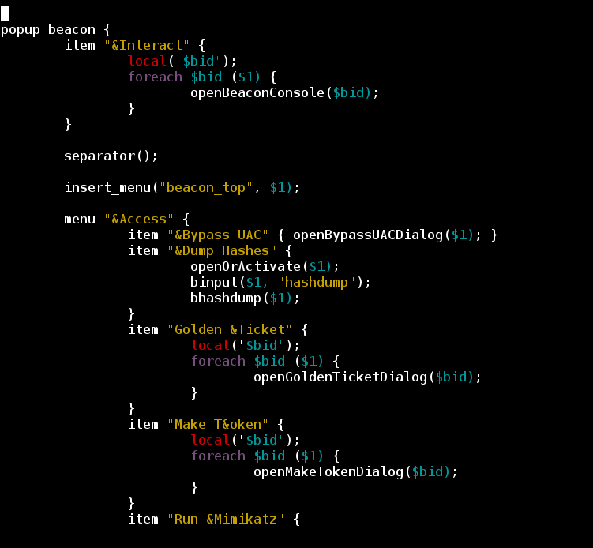

Cobalt Strike
===
## Cobalt Strike 客户端
Aggressor Script 引擎是融入到Cobalt Strike,并且成为了一个主要功能。大多数Cobalt Strike对话框和功能特性都是作为独立模块编写的，这些模块将展示一些Aggressor Script引擎的接口。  
内部脚本[default.cna](https://www.cobaltstrike.com/aggressor-script/default.cna)定义了默认的Cobalt Strike界面体验。该脚本定义了Cobalt Strike的工具栏按钮，弹出菜单，并且还为大多数Cobalt Strike事件格式化输出。
本章将向您展示这些功能如何工作，并使您能够根据您的需要设计Cobalt Strike客户端。

## 快捷键设置

脚本可以创建快捷键。使用 **bind** 关键字绑定快捷键。这个例子是：通过快捷键**Ctrl + H** ,在对话框中显示 **Hello World！**。
```
bind Ctrl+H {
	show_message("Hello World!");
}
```
键盘快捷键可以是任何ASCII字符或特殊 **key**。快捷键可能有一个或多个修饰符应用于它们。修改器是:Ctrl、Shift、Alt或Meta。脚本可以指定修饰符+ *key*。

## 弹出菜单

脚本还可以添加到Cobalt Strike的菜单结构中或重新定义它。**popup** 关键字使用一个 **popup hook** 构建一个菜单层次结构。
以下是定义Cobalt Strike帮助菜单的代码：
```
popup help {
        item("&Homepage", { url_open("https://www.cobaltstrike.com/"); });
        item("&Support",  { url_open("https://www.cobaltstrike.com/support"); });
        item("&Arsenal",  { url_open("https://www.cobaltstrike.com/scripts?license=" . licenseKey()); });
        separator();
        item("&System Information", { openSystemInformationDialog(); });
        separator();
        item("&About", { openAboutDialog(); });
}
```
该脚本 hooks 到帮助菜单并定义了几个菜单项。带有 **&** 符号的菜单名称是其界面展示的对应项。 当用户单击它时，与每个条目相关联的代码块就会执行。  
脚本也可以定义带子的菜单。菜单关键字定义了一个新菜单。当用户在菜单上停留时，将执行与之关联的代码块，并用于构建子菜单。
这是 **Pivot Graph** 菜单的一个例子:
```
popup pgraph {
       	menu "&Layout" {
		item "&Circle"    { graph_layout($1, "circle"); }
		item "&Stack"     { graph_layout($1, "stack"); }
		menu "&Tree" {
			item "&Bottom" { graph_layout($1, "tree-bottom"); }
			item "&Left"   { graph_layout($1, "tree-left"); }
			item "&Right"  { graph_layout($1, "tree-right"); }
			item "&Top"    { graph_layout($1, "tree-top"); }
		}
		separator();
		item "&None" { graph_layout($1, "none"); }
	}
}
```
如果您的脚本用Cobalt Strike菜单 hook 指定了一个菜单层次结构，那么它将添加到已经存在的菜单中。使用**&popupclear**功能清除其他已注册的菜单项，并重新定义一个层次结构。
## 自定义输出
Aggressor Script中的 **set** 关键字定义了如何格式化事件并将其输出呈现给用户。以下是set关键字的示例：
```
set EVENT_SBAR_LEFT {
	return "[" . tstamp(ticks()) . "] " . mynick();
}

set EVENT_SBAR_RIGHT {
	return "[lag: $1 $+ ]";
}
```
上面的代码定义了 Cobalt Strike 事件日志中的statusbar的内容(**View -> Event Log**)。这个statusbar的左边显示了当前的时间和您的昵称。右侧显示了在您的钴Cobalt Strike客户机和team server之间传递消息的往返时间。  
您可以覆盖Cobalt Strike默认脚本中的任何设置选项。创建您自己的脚本，并定义您关心的事件。把它装载到Cobalt Strike 中。Cobalt Strike 将会使用你的定义，而不是内置的。
## 时间日志
使用 **on** 关键字为事件定义一个处理程序(handler)。当Cobalt Strike 连接到team server并准备代表您进行操作时，**ready** 的事件就会发生。
```
on ready {
	show_message("Ready for action!");
}
```
Cobalt Strike 为各种各样的情况都生成了事件。使用 * 元事件来观察Cobalt Strike的所有事件。
```
on * {
	local('$handle $event $args');
	
	$event = shift(@_);
	$args  = join(" ", @_);
	
	$handle = openf(">>eventspy.txt");
	writeb($handle, "[ $+ $event $+ ] $args");
	closef($handle);
}
```

