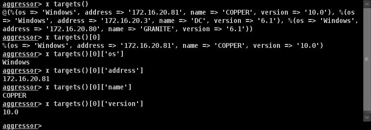

Data Model
===
Cobalt Strike teamserver存储您的主机，服务，凭据和其他信息。 它还广播此信息，并将其提供给所有客户端。
## Data API
使用 **&data_query** 函数查询Cobalt Strike的数据模型。 该函数可以访问 Cobalt Strike 客户端维护的所有状态和信息。 使用 **&data_keys** 来获取可以查询的不同数据的列表。 此示例查询Cobalt Strike的数据模型中的所有数据，并将其导出为文本文件：
```
command export {
	local('$handle $model $row $entry $index');
	$handle = openf(">export.txt");
	
	foreach $model (data_keys()) {
		println($handle, "== $model ==");
		println($handle, data_query($model));
	}
	
	closef($handle);
	
	println("See export.txt for the data.");
}
```
Cobalt Strike提供了几个功能，使数据模型更加直观。

|Model|Function|Description|
| ------------- |:-------------:| -----:|
|applications	|&applications	|System Profiler Results [View -> Applications]|
|archives|	&archives	|Engagement events/activities|
|beacons	|&beacons|	Active beacons|
|credentials|	&credentials	|Usernames, passwords, etc.|
|downloads|	&downloads|	Downloaded files|
|keystrokes	|&keystrokes	|Keystrokes received by Beacon|
|screenshots|	&screenshots	|Screenshots captured by Beacon|
|services	|&services	|Services and service information|
|sites	|&sites	|Assets hosted by Cobalt Strike|
|socks	|&pivots	|SOCKS proxy servers and port forwards|
|targets	|&targets	|Hosts and host information|
这些函数为数据模型中的每个条目返回一行数组。每个条目都是具有描述条目的不同键/值对的字典。  
了解数据模型的最好方法是通过Aggressor Script控制台进行研究。转到 **View** -> **Script Console** 脚本控制台，并使用 `x` 命令来评估表达式。例如：

使用 `on` `DATA_KEY`  可以订阅特定数据模型的更改。
```
on keystrokes {
	println("I have new keystrokes: $1");
}
```


